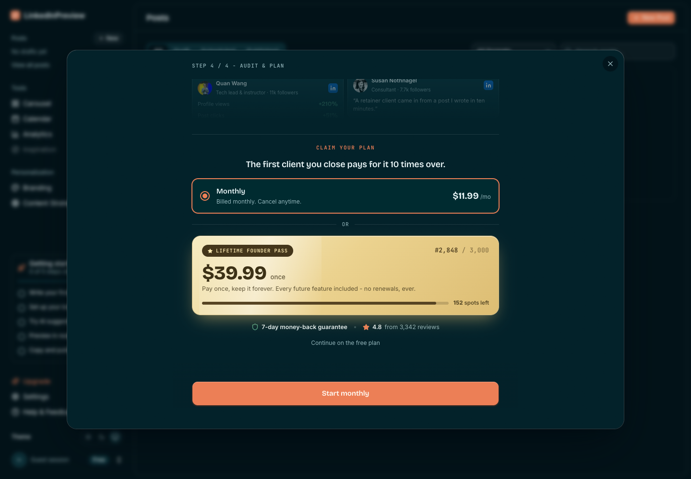
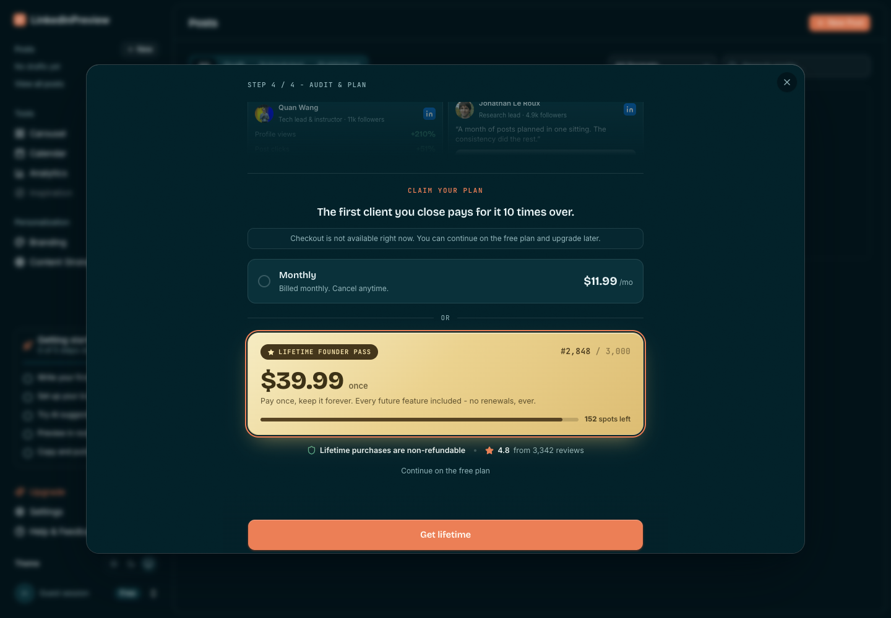
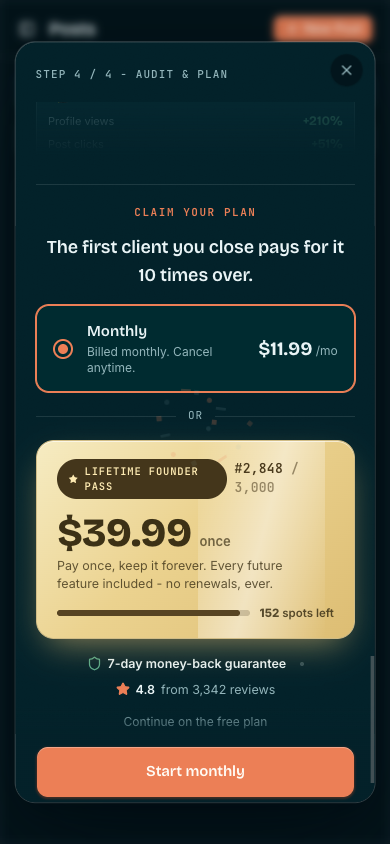
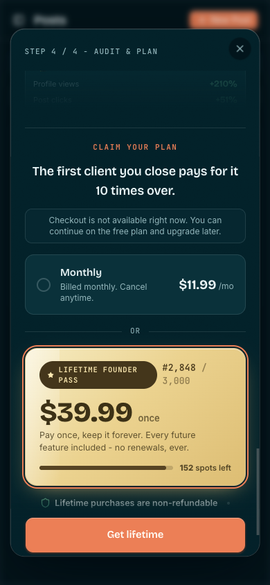
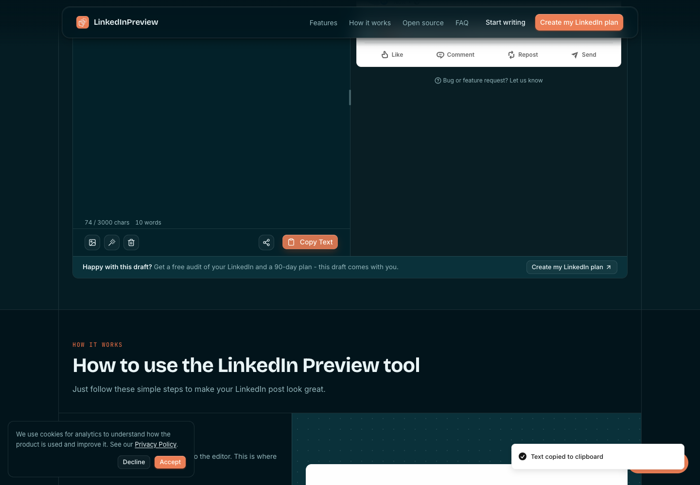
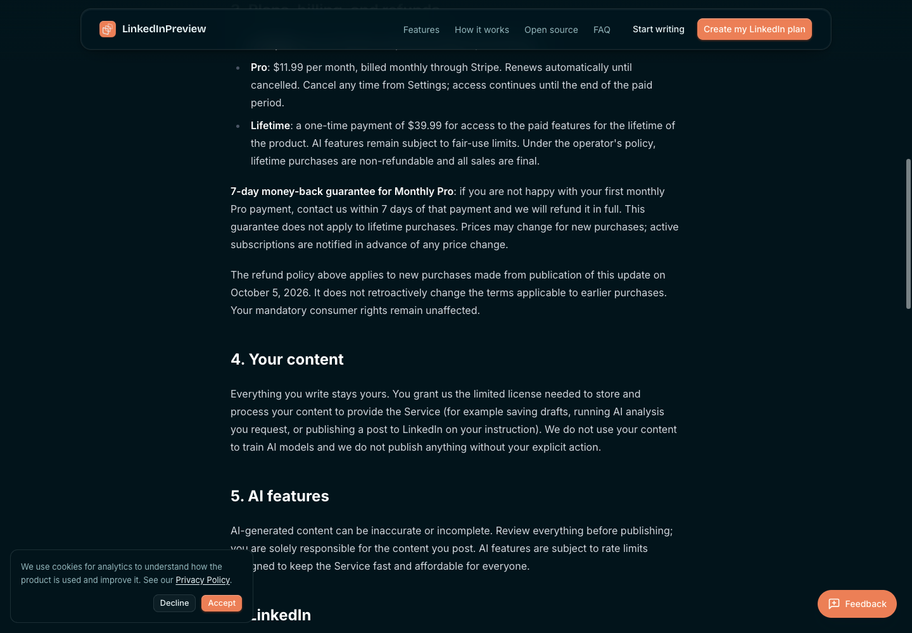
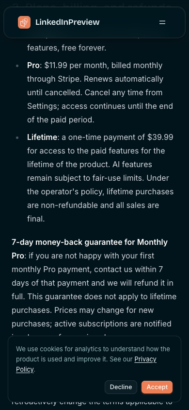

# LIN-113 October 6: actual terms integration and identity correction

PR: https://github.com/gatteo/linkedinpreview.com/pull/96
Branch: `feat/exp9-monthly-first-offer`
Application code SHA: `80435eecd3231162a33dab1e125d667ecd43dcac`
Integrated actual main: `ecd42c84ee7a2d44c7166fed35d1f8ea749af4d8` (accepted terms PR #103)
Normal integration merge: `68a4fb659d07f4c1694e162b51bbe0bdbfef9fc0`
Ready deployment: `dpl_BJjQSDY77FdCyuHtBi5AXyWn7bnM`
Preview: https://linkedinpreview-n5zxpsa6a-gatteos.vercel.app
Code-head CI: https://github.com/gatteo/linkedinpreview.com/actions/runs/37420250117/job/112127773579

The old October 5 review LIN-118 returned CHANGES, not approval. PR #103 is now on actual main, not a prospective merge.
A NEW exact-head independent Sentinel review is required. Real LIN-87 completed-day/runtime clearance and Atlas-only
release on LIN-61 remain separate. This evidence is not production health or launch authorization.

## Correction and measured regressions

Actual PlanProvider plus PaywallStep reproduced seven failures out of eight identity/pending/error tests before the fix.
The raw original red output is `identity-red.log`. No passing reproduction was fabricated.

Billing state now carries owning userId atomically with data, pending and resolved state. Before effects run for a new
identity, consumers get pending/unresolved default state, never preceding-account billing. Paywall enrollment additionally
requires billingUserId to match auth userId. Own failed reads remain unknown. Canceled reads and old Realtime callbacks
cannot update the current identity. The billing query filters expected user_id under existing RLS and rejects a mismatched
returned owner. Existing refresh/current Realtime entitlement updates and original assignment clocks remain intact.

Actual provider/gate matrix: free->monthly, monthly->free, free->lifetime, lifetime->free; initial pending/error; new-account
read failure; rapid switches; late read success/error; stale/current Realtime; unready/failed anonymous auth. Actual billing
reader tests exercise account filter, owner check, all three plans, absent row and read error. No server/payment authorization
is delegated to attribution metadata. Existing checkout/webhook/entitlement tests and accepted purchase-policy tests run too.

Final actual Node 22.23.1 execution: 66/66 tests, zero failures; type-check, lint, clean, build all exit 0. Lint has zero errors
and the two established TanStack warnings. Build generated 263/263 routes. Known Contentlayer post-generation
ERR_INVALID_ARG_TYPE remains before the successful Next build. Raw logs are `tests.log`, `type-check.log`, `lint.log`,
`clean.log`, `build.log`. Code-head CI gates, Vercel and Preview Comments passed; Vercel metadata was READY at the code SHA.

## Current contained preview smoke

`checks.json` has 25 unique assertions, all passed, collected in batches and counted/deduplicated in Python.

- Desktop 1440x1000 and mobile 390x844: monthly first/default; $11.99/$39.99, live proof and urgency preserved.
- Monthly displays approved seven-day guarantee; lifetime displays non-refundable policy and no blanket guarantee.
- Both-plan checkout intent payloads on both viewports retain the exact enrollment, clock, release SHA and first-touch navbar
  source. Actual checkout request is intercepted before dispatch and returns explicit synthetic unavailability.
- Reload through billing_return retains original enrollment/clock/source. Free fallback reaches confirmation and dashboard.
- Free home editor accepts actual input and updates preview. Actual pointer Copy Text shows toast; original unmodified
  Clipboard API reads back the exact entered text. `/blog` and `/dashboard` render without captured runtime errors.
- Desktop/mobile `/terms` has both accepted plan policies, prospective date, earlier-purchase protection and consumer-rights
  preservation. Mobile offer/terms have no page horizontal overflow.

Containment: `tests/fixtures/monthly-offer-browser.js` installed on a fresh blank tab BEFORE preview navigation, with marker
`lin113-contained-v2` asserted before EACH page action. Explicit Network blocks cover Supabase, Stripe, API routes, ingestion,
providers, LinkedIn/publishing and support widgets. Synthetic auth/data/checkout adapters only, no card entry, live Checkout
Session, provider probe, payment, publication or production health claim. `dashboard-requests.json` records intercepted calls.
Four actual intended checkout payloads and `enrollment-before.json` are saved beside the assertions.

Scaffolding failures are not successful runs: an intermediate preview harness hard-coded the moving urgency counter and
wrong retry/CTA labels, used a moving/offscreen pointer coordinate, and had a selector-quoting/hydration timing error. These
were corrected without changing product copy or counting failed assertions. Cross-origin navigation lost the injected
marker; no page action was taken, and a fresh blank-tab installation repaired it. A background-tab animation initially
paused the free confirmation handoff; foregrounding the tab and completing the actual confirmation passed. Final-head
assertions were persisted incrementally and all 25 succeeded. The intermediate code-head evidence is retained locally in
`.git/lin113-oct06-first-pass`, not presented as this SHA's smoke.

## Screenshots

## Release and attribution boundaries

Monthly hierarchy remains the sole offer treatment; no new badge/claim is added. Draft-first PR #104 remains separate and
preserved, with no artificial seven-day implementation delay. EXP-9 revision 2 registration and day14, first200/five-start,
day30 and day37 decisions remain unchanged. Overlapping windows are confounded and cohort paid starts are never summed.
The metric is NEW processor-confirmed recurring accounts within seven days / mature verified-unpaid eligible accounts,
plus net new MRR; checkout clicks/completion are not paid success. Historical baseline 3 active/$35.97 is dated source
contract evidence, not a fresh measurement. Atlas/Sentinel lock the actual release baseline; LIN-112 owns processor
reconciliation and prior-recurring-history check. Upstream/cross-device/storage/telemetry loss remains explicit unknown.

No main push/merge, deploy config, production data/Stripe mutation, customer contact, provider probe or LinkedIn action.
New purchases $0; provider cost unknown. Rollback before merge: close #96. After Atlas release, review an isolated revert of
its actual squash SHA, preserving payment/customer/attribution history. A new integration/code change requires refreshed
checks/preview and NEW exact-head review again. No earlier approval is reused.
