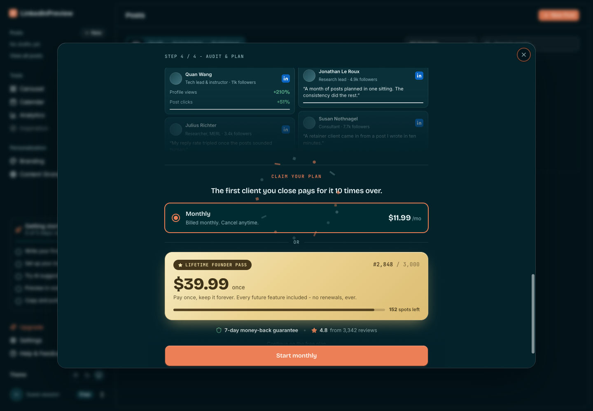
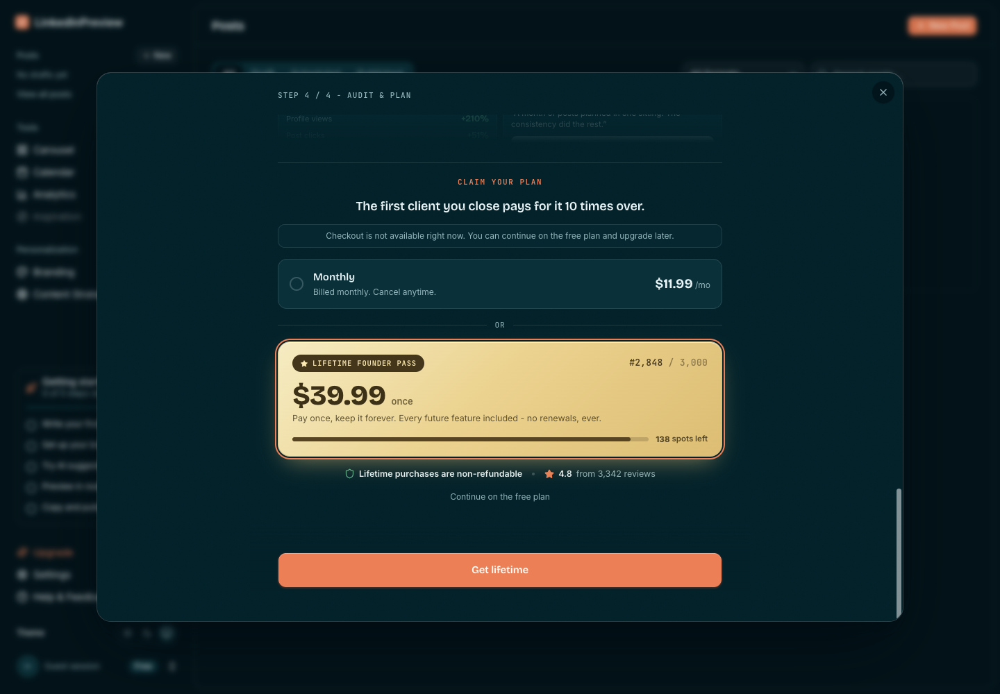
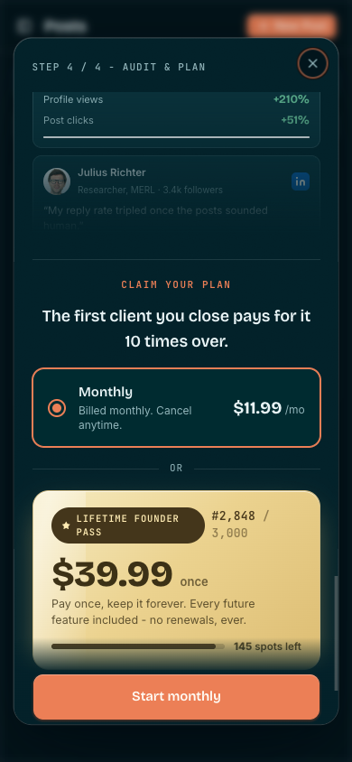
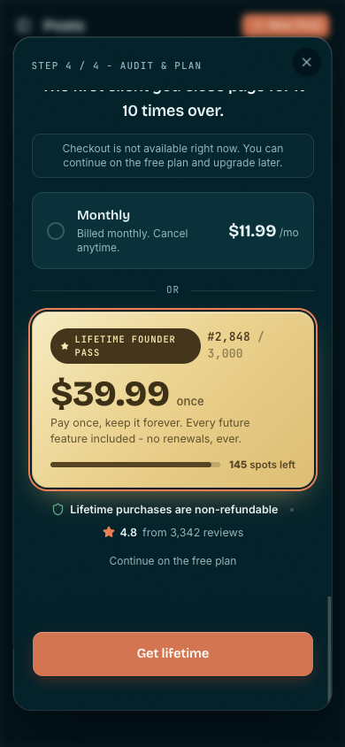
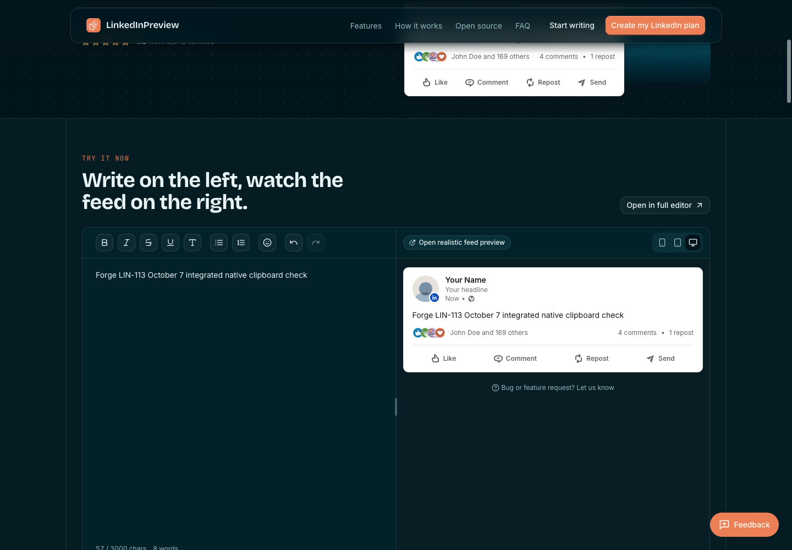
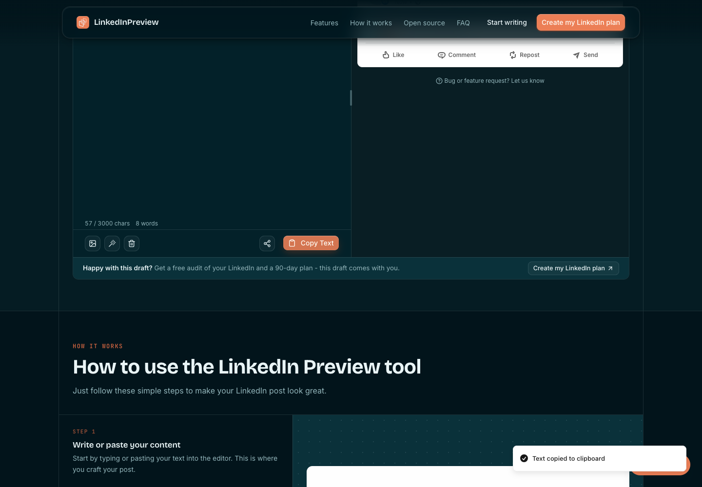
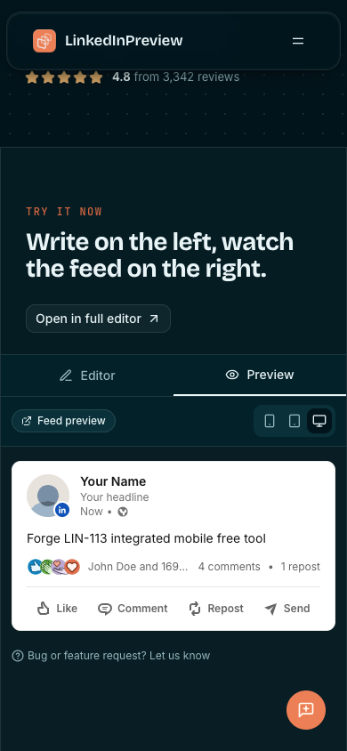
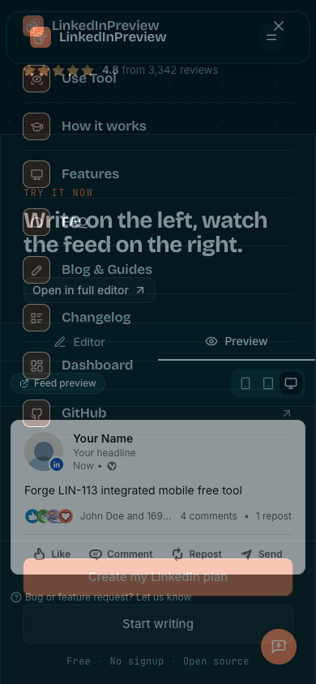
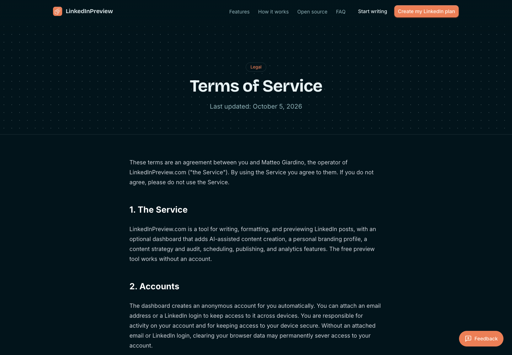
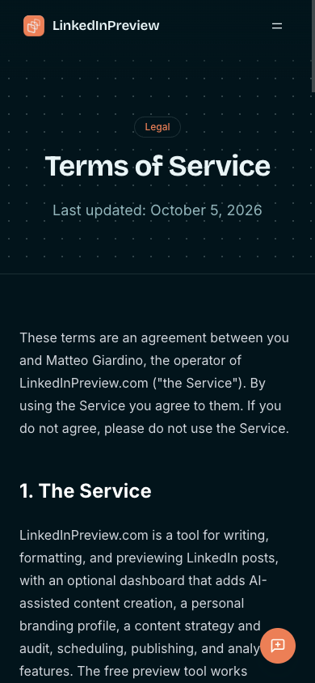

# LIN-113 October 7 current-main integration evidence

## Artifact and basis

Same PR [#96](https://github.com/gatteo/linkedinpreview.com/pull/96), branch `feat/exp9-monthly-first-offer`.
Normal merge/application head `6b975c502bbc51f3e0be67b160894c7df4c66e62` has parents
`6d0b07c01f466eaf2386a5375d53ed007bd8d31e` and actual main
`86011f3beb217cf5902a740a9b6cc5bd7033244a`. No force-push or replacement PR.
Main is five commits after accepted terms basis `ecd42c84ee7a2d44c7166fed35d1f8ea749af4d8`:
content #101/#106/#107/#108 and staged control-only header #109.

Application/header/hook/config files from main are identical to main. No offer code changed in this slice.
Existing monthly default/order, current selected-plan policy, $11.99/$39.99, proof/urgency/free access,
identity-owned billing and processor attribution remain. Added `monthly-header-integration.test.mjs`
exercises both actual enrollment libraries against shared storage and proves frozen control, independent IDs,
original source, eligibility clocks and checkout attribution. Existing actual-provider identity matrix retained.

Onboarding dictionary merge had no textual conflict. Both release sections retained. Corrected the stale
rendered-view denominator row to match the accepted pre-render eligibility contract. No EXP-11 activation,
new framework, new flag, guest/customer/draft backend write, provider call or live checkout.

## Real local and remote gates

Node `v22.23.1`: `node --test tests/*.test.mjs` passed 104/104, zero failures, including subtests.
`pnpm type-check`, `pnpm lint`, `pnpm clean`, `pnpm build` all exited zero.
Lint: zero errors, two established TanStack warnings. Contentlayer generated 209 documents and emitted the
known post-generation `ERR_INVALID_ARG_TYPE`; subsequent Next build succeeded, 263/263 routes.
Raw logs are beside this README. Type-check is independent of Next's configured skipped build validation.

Application-head CI gates SUCCESS:
https://github.com/gatteo/linkedinpreview.com/actions/runs/37611886764/job/112760818619
Vercel and Preview Comments SUCCESS. Vercel API maps READY deployment
`dpl_CQJDjQm821QT8JXScMLur4BhohAQ` to exact application head above:
https://linkedinpreview-21i1b3kku-gatteos.vercel.app

Evidence-only commits after that application head contain docs/screenshots/JSON only. Their application diff
must remain empty and exact final-head CI must be independently checked. Do not claim a canceled docs-only
deployment is built or reuse LIN-122 as new-head approval.

## Contained preview execution

`smoke-summary.json` programmatically deduplicates 29 verified behavioral checks. Ten separate final error
checks are empty; all ten isolated contexts closed. `browser.json` retains one excluded diagnostic record:
native clipboard passed but a p-only preview selector was false. Corrected exact DIV/feed assertion passed.

Verified desktop 1440x1000 and mobile 390x844:

- Current monthly first/default, both prices, proof/urgency and no added Most popular badge.
- Monthly seven-day guarantee and lifetime non-refundable selected policy; no blanket lifetime guarantee.
- Four actual both-plan checkout intents intercepted before dispatch, with enrollment/cohort/release SHA,
  original navbar source, eligibility clock and verified-free billing. Synthetic unavailability renders free fallback.
- Free confirmation and Open my dashboard return to Posts on both viewports.
- Actual header-to-dashboard-to-offer navigation preserves the header control object exactly while monthly
  enrollment has its own ID/clock. Billing return preserves both objects. Header control reload stays frozen.
- Native desktop header pointer intent retains `/dashboard?from=navbar`, held locally before navigation.
- Free editor native `Input.insertText`, feed preview and pointer Copy Text; original unmodified Clipboard API
  exact readback on desktop/mobile. Mobile menu unchanged, with no desktop header enrollment or overflow.
- `/embed` native input/copy, `/blog` H1 and `/dashboard` rendered.
- Desktop/mobile current terms, both prices/policies, October 5 prospective date, grandfathered earlier purchases
  and mandatory consumer rights; no page horizontal overflow.

Containment installed on fresh about:blank isolated contexts BEFORE every initial navigation. Synthetic
`monthly-offer-browser.js` plus transport/header adapter, asserted markers before interactions, explicit CDP
backend/API/processor/provider/LinkedIn/telemetry/support blocks. Subsequent same-context navigation retained
and reasserted the preload/blocks. No cards, live auth/Session/payment/provider/publishing or cleanup.
This is actual rendered route/offline fixture verification, NOT live payment processing or production health.
Header analytics transport collector did not provide remote event evidence; actual hook/component regressions
exercise SDK callbacks offline. No invented event join. Header super-properties are not processor metadata.

Harness failures repaired without product edits or counting them as passes: DOM object wait exceeded
serialization depth, changed to boolean; editor-center pointer accidentally opened AI sheet, closed without
Generate action and used native editor focus/input; p-only preview query changed to exact feed DIV;
auto checkout-error fallback made Back to your plan absent, verified actual fallback instead; current lifetime
CTA is Get lifetime. Raw diagnostic record retained. No provider/backend dispatch occurred from these actions.

## Screenshots

## Handoff and release boundary

NEW exact-head independent Sentinel review required; LIN-122 is historical. Atlas alone merges on original
LIN-61 after actual LIN-87 October 8 second-day endpoint and current release gates. No extra observation day,
EXP-7/October 10, PostHog setup or maturity dependency. #104/#105 preserved and separate.

Primary metric remains NEW positive-live-first-paid-invoice-confirmed recurring accounts within seven days /
mature verified-unpaid eligibles, plus net new MRR. LIN-112 owns processor/prior-history reconciliation.
Dated source baseline 3 active / $35.97 is not a fresh Forge Stripe read or release eligibility baseline.
Day14 reach/activation, first200/five-start business hurdle, day30 stop/zero-start and day37 attribution retained.
Overlapping monthly/draft windows are confounded; never sum cohort paid starts. Cross-device/account,
upstream source/storage/identity/telemetry loss remain explicit unknown/unmatched.

Before launch retain/close unmerged #96. After Atlas release, independently review an isolated revert of the
actual production squash SHA, preserving payment/customer/draft/cohort history. No placeholder revert.
No production/config/data/price/payment/contact/LinkedIn action. New purchases $0; contribution cost unknown.
