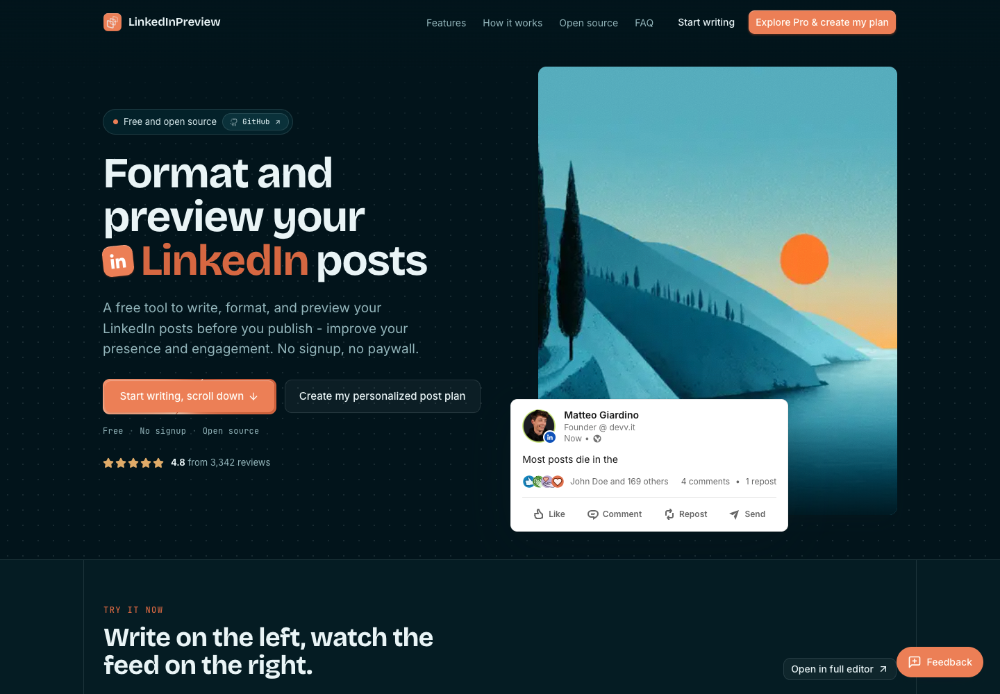
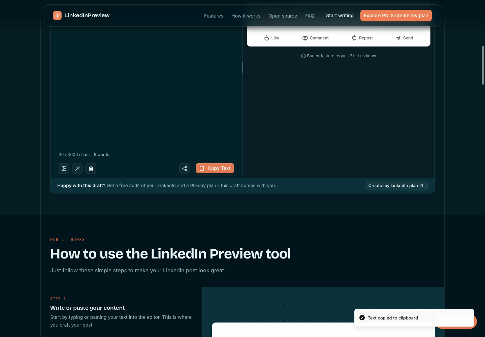
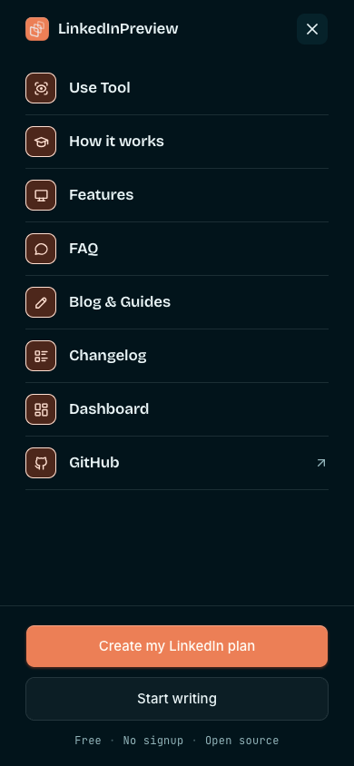
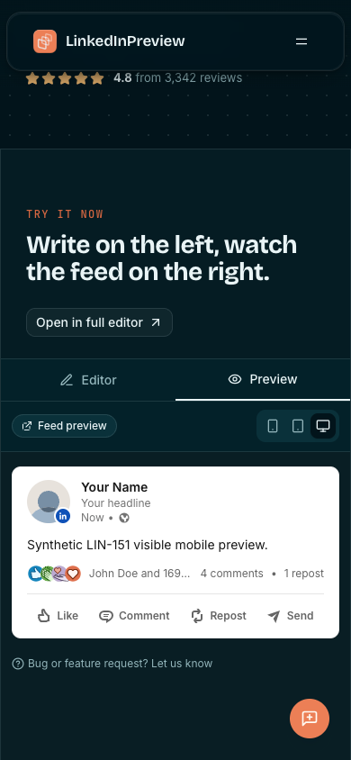

# LIN-151 verification and contained preview evidence

Implementation preview: eab94d76d244086ddefa3e6d3ab3bf3233bcd2fa, READY deployment dpl_Gbaux7oJhYEXzJWsxYkPdicQugwV, https://linkedinpreview-ojtfcb824-gatteos.vercel.app. Exact final PR-head preview is separately verified on the issue before review; this evidence addition changes tests/fixtures/docs only, not application behavior.

- Node22.23.1 focused hook/enrollment31 tests plus four actual React component/DOM boundary cases passed. Full suite79/79 including subtests, type-check/lint/clean/build exit0. Two established table lint warnings remain. Build generates209 content documents/263 routes; known Contentlayer post-generation TypeError is recorded before Next succeeds. update-docs skill unavailable, docs updated manually.
- Actual React tests exercise eligibility-before-flag-before-assignment-before-exposure, retained original click event, same enrollment/source on action, mobile/blog exclusions, and in-page remote-disable fallback. SDK dependency and primitive Link/Button boundaries are synthetic; no live telemetry assertion.
- Contained browser records:22 complete final records among24 unique raw records. Four desktop variants (control/pro/unknown/loading), eight held native pointer/Enter intents, treatment remount/refresh with same ID, sticky-treatment disabled -> rendered control, desktop/mobile typing/live preview/native Clipboard API exact readback, visible mobile preview, unchanged mobile menu, /blog, /dashboard and /embed. Final asserted contexts closed and final uncaught-error lists empty. Preliminary records are explicitly not final acceptance.
- Fixture and CDP blocks were installed/asserted in the same call before each fresh-context navigation/action. Auth/database/provider/payment/telemetry attempts are synthetic adapters, never live paid/access/durability proof. Local cached SDK flag variants are synthetic. Backend fixture comes from preserved PR104 fixture at20b4de7529d63287d9101c33890bfb0007134a84, not unreleased application integration. Native clipboard was not mocked.
- Browser telemetry transport did not expose daily event records through the initial SDK stringify collector. No fabricated event response/readback is claimed. Actual executable component tests validate event callback order/metadata; real production event readback remains Atlas's launch gate.
- Harness failures disclosed: DOM object serialization (boolean wait fixed); cross-call target selection gave a default viewport (recollected all final cases atomically in fresh explicit contexts); first preview matching expected two p elements rather than actual p/div (fixed selector); Next soft navigation continued after Navigation API cancellation (final pointer/keyboard tests explicitly hold default navigation at capture and record intended unchanged href, not successful dashboard auth). Initial throwing XHR fixture errors and two preliminary React418 records were removed by non-throwing synthetic transport and blocking GTM/Google analytics resources; final cases have no uncaught errors. Initial GTM static script loads are not proof of live authenticated backend writes; no broader server-side absence claim.
- Application diff against main for free tool, mobile nav, dashboard, API, pricing and billing is empty. Existing#96/#104/#105 preserved. Flag read HTTP200, complete1 flag existing onb-modal-exit only; management write permission remains unverified. Runtime setup attempts failed validation twice and stopped. No remote flag write/config/env/production/customer/payment/contact/LinkedIn action or purchase.

NOT LAUNCHED. Atlas records management/config readback and real activation clock before any live claim. Prelaunch fallback records, browser identity and achieved arm imbalance require separate accounting. Sentinel gives independent exact-head QA, never Forge's own verdict. Rollback before merge closes PR109; after activation Atlas disables/readbacks actual onb-header-pro-entry; after release Atlas reverts the actual isolated production squash, which does not yet exist. All customer/payment/entitlement history is preserved.

Screenshots below are the implementation preview, with exact-head recheck evidence on the issue:

